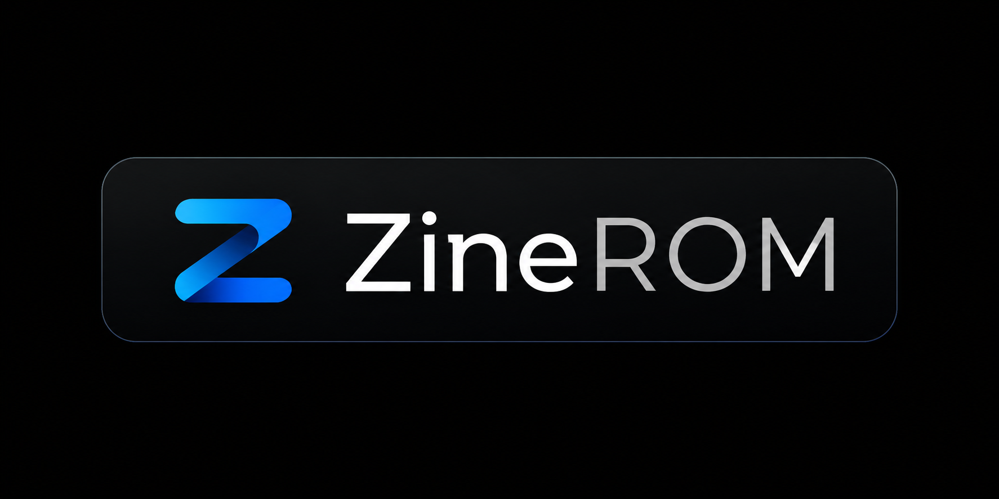

  

---

📦 ZineROM Project

A custom Android ROM project focused on deep system modification, advanced UI enhancement, and performance-oriented framework tuning.

Maintained by: @zinefather

---

⚙️ ZineROM Engine

ZineROM Engine is the core system layer running behind all ZineROM builds and project infrastructure;

# Comprehensive Feature Sheet (ZineROM Update 8.5)

### Full-Scale Galaxy AI Suite (Next-Gen Intelligence)
Experience unrestricted flagship artificial intelligence, optimized to execute efficiently without introducing system overhead:
* **Writing and Note Assist:** Advanced contextual text rewriting, auto-formatting, automated summaries, and system-wide spelling corrections.
* **Semantic Search and Interpreter:** High-speed local data indexing alongside real-time conversation translation modules.
* **Drawing and Creative Assist:** Generative sketching tools and intelligent image interpretation frameworks.
* **Browsing, Call, and Transcript Assist:** Automated web article summarization, real-time call translation, and smart voice-to-text audio scrubbing.
* **Advanced Media Erasers:** Complete native integration of Object Eraser, Shadow Eraser, Reflection Eraser, and Audio Eraser.

### Flagship Visuals and Premium Framework Injection
* **ZineROM Update Screen 8.5:** An exclusive, integrated system update dashboard alongside customized UI compilation layouts.
* **High-End Animation Scaling:** Full flagship transition physics injected directly into the core animator framework.
* **Native and Live Blur Engine:** Real-time Gaussian blur processing enabled system-wide across the notification panel and application windows.
* **AOD Clock Transition Support:** Seamless, uninterrupted display handoff from the Always On Display to the secure lock screen.
* **Adaptive Color Tone and Refresh Rate:** Active system monitoring to adjust screen warmth and dynamically scale refresh rates based on active content.
* **Extra Brightness Mode:** Decouples hardware-level restrictions to unlock maximum display nit levels under direct sunlight conditions.

### Advanced Imaging and System Ergonomics
* **Picture Remaster and Image Clipper:** High-fidelity photo restoration algorithms and smart long-press object lifting from the native gallery.
* **Samsung DeX Support:** Full desktop environment execution unlocked natively (Note: *DeX via HDMI requires target hardware with USB-C DisplayPort support*).
* **Camera Privacy Toggle:** Hardware-level privacy masking executed via a native system quick-setting tile.
* **Multi-User Profiles:** Complete isolated space provisioning for independent user environments on a single device configuration.
* **Universal Dual Messenger:** Overridden framework restrictions to allow cloning and dual-instance execution for all installed applications.

### Underlying Optimization and Base Architecture
* **Monolithic Base Fusion:** Compiled using the latest stable flagship branches from Galaxy S23 FE, A35, S21 FE, and S24+ firmwares
* **EROFS Powered Filesystem:** Read-only system partitions are strictly packed using EROFS to guarantee maximum compression, faster random-read speeds, and zero system degradation over time.
* **Deep Debloating:** Completely stripped of unnecessary background tracking services, duplicate carrier utilities, and battery-draining telemetry scripts.

The engine is designed to enable high-level system control without breaking core structure stability 

---

📦 Design Philosophy

ZineROM is built with the idea of:

Removing unnecessary system limitations

Enhancing user control over the system

Improving smoothness and responsiveness

Creating a modern, refined Android experience

Extending native One UI behavior through safe modification layers

---

📢 Updates & Support

Telegram:

https://t.me/customromguy

https://t.me/customromerguy

---

🧠 Credits

ZineROM Engine development by @Zinefather and ZineROM Team 
(high modification fork of QuantumROM Tool)
